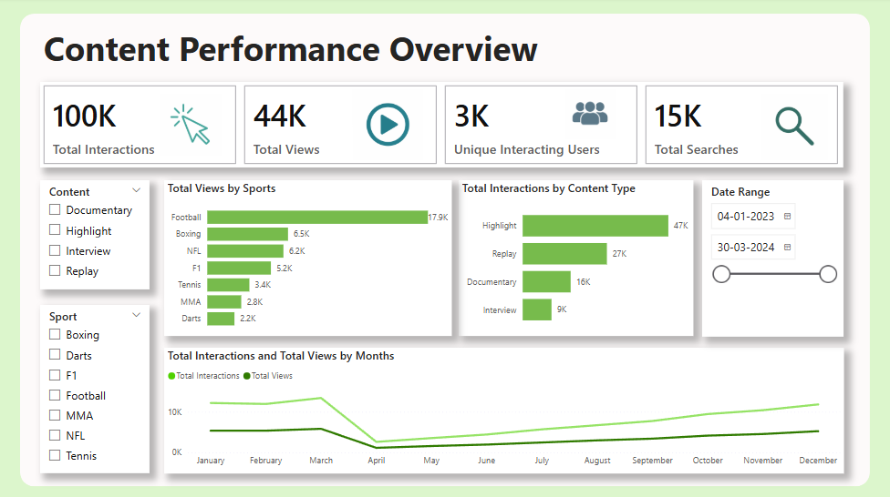
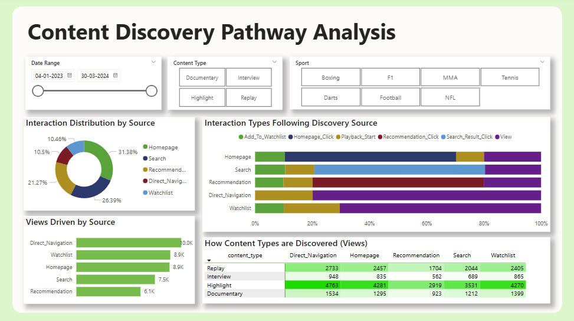
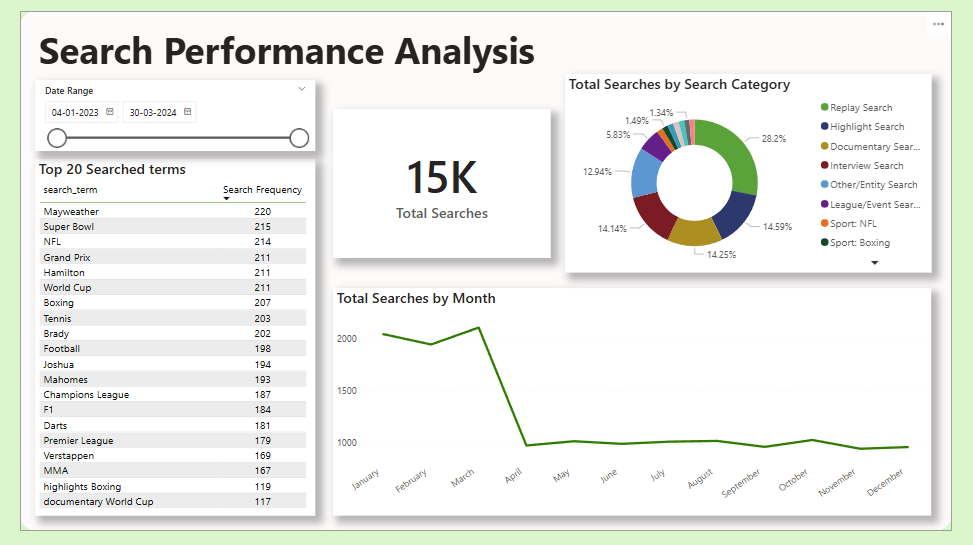

# Non-Live Content Discovery Analysis & Optimization (Simulated Data Case Study)

Analyzed simulated user interaction patterns to identify key drivers of non-live content discovery (Replays, Highlights, etc.) on a sports streaming platform. The goal was to provide actionable insights for improving user engagement and optimizing discovery pathways.

## Key Insights & Actionable Recommendations

This analysis yielded several key findings leading to potential optimizations:

1.  **High Engagement with Highlights & Replays:**
    *   *Insight:* Highlight and Replay content types drove the vast majority of user interactions and views.
    *   *Recommendation:* **Prioritize placement and discovery** for Highlights/Replays on key surfaces (Homepage, Search). Ensure efficient production pipelines.

2.  **Homepage & Search Dominate View Conversions:**
    *   *Insight:* While multiple sources led to interactions, the Homepage and Search were significantly more effective at converting discovery into actual content views.
    *   *Recommendation:* **Maintain and continuously optimize** content surfacing logic for the Homepage. Ensure Search results are highly relevant and leverage popular search term insights.

3.  **Opportunity in Recommendations:**
    *   *Insight:* The Recommendation engine drove interactions (clicks) but had a lower conversion rate to direct views compared to Search or Homepage clicks.
    *   *Recommendation:* **Evaluate and potentially refine the Recommendation engine.** A/B test algorithms or presentation styles focusing on increasing view-through rate from recommended items.

4.  **Specific User Intent in Search:**
    *   *Insight:* Users frequently searched using specific keywords like "highlights," "replay," and sport names, indicating clear intent.
    *   *Recommendation:* **Utilize popular search terms** to inform content tagging, metadata optimization, and potentially identify gaps in content offerings.

5.  **Watchlist Underutilization for Views:**
    *   *Insight:* Adding content to a Watchlist was common, but the Watchlist itself was a less frequent source of initiating views compared to other channels.
    *   *Recommendation:* **Explore tactics to re-engage users with their Watchlist,** such as personalized notifications or dedicated surfacing sections.

## Dashboard Highlights

Visual analysis and insights were consolidated in an interactive Power BI dashboard (`PowerBI_visualization/content_discovery_analysis_visual.pbix`). Key views:

## Tech Stack

*   **Database & Analysis:** PostgreSQL (SQL)
*   **Visualization:** Power BI

## Data Source Note

Analysis is based on **simulated** user data due to the proprietary nature of real interaction logs. Sample data is provided in the `Data_files/` folder. SQL analysis queries are in `SQL_analysis/`.
